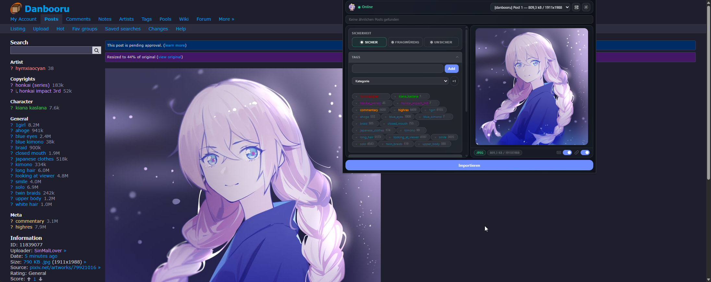
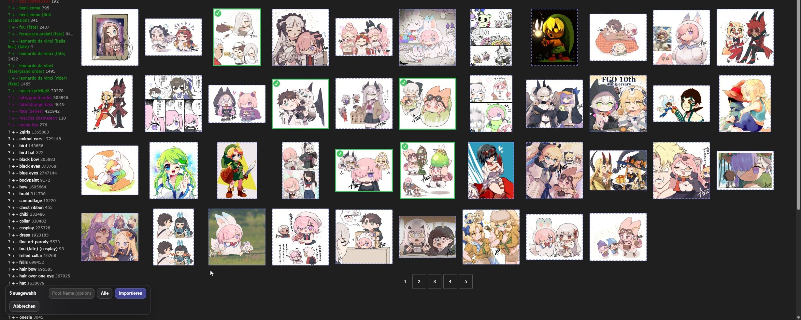
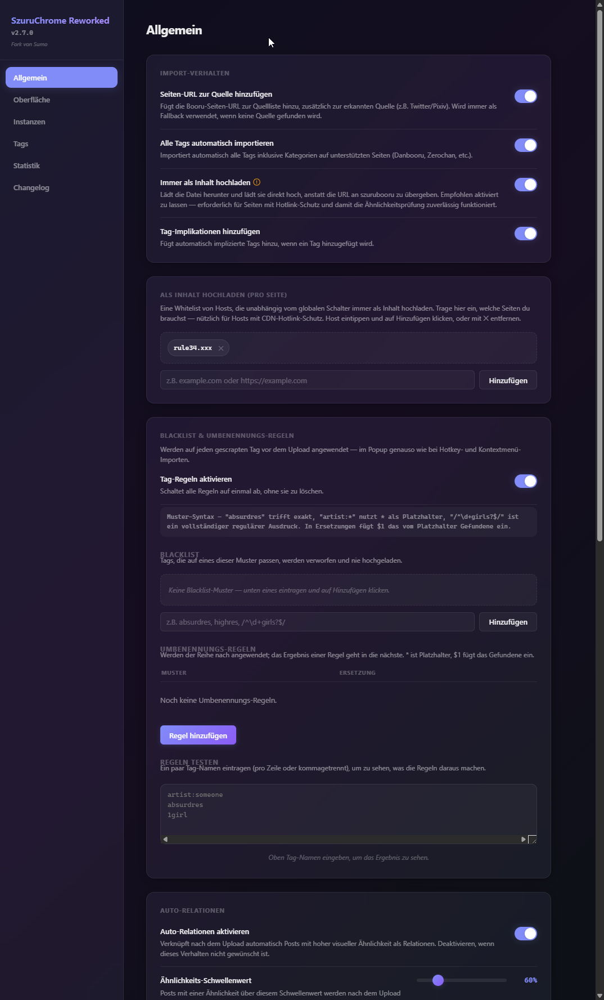
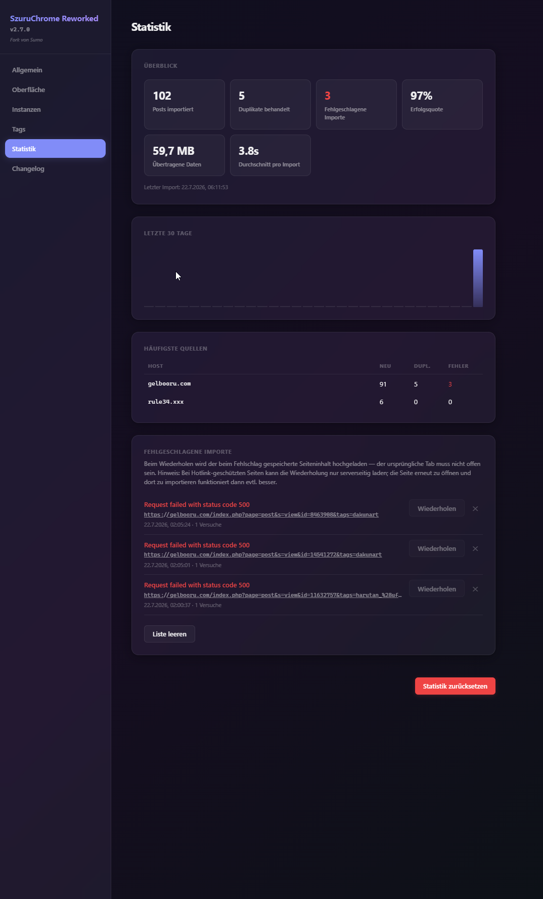
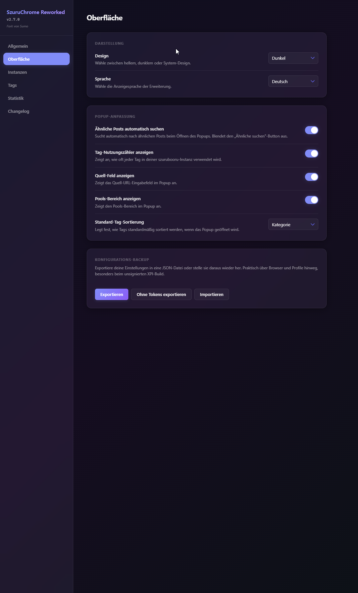
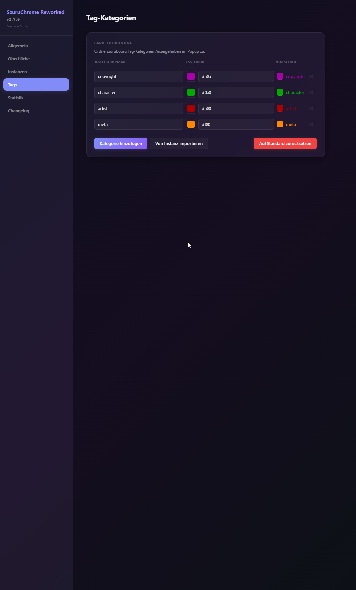
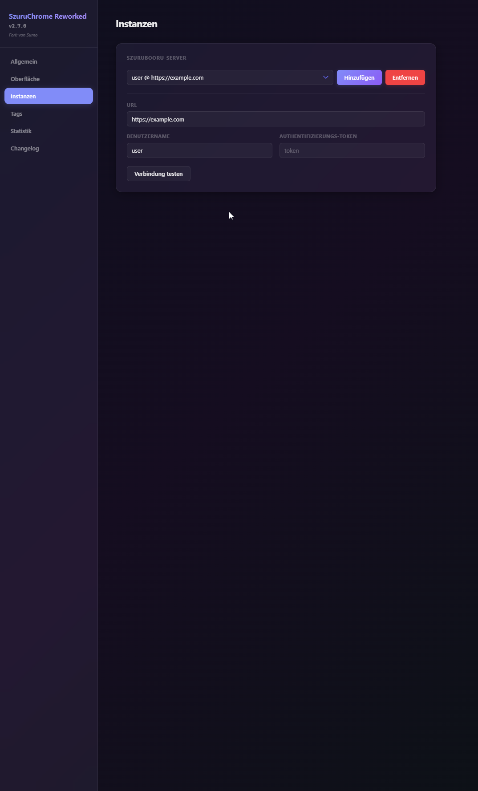
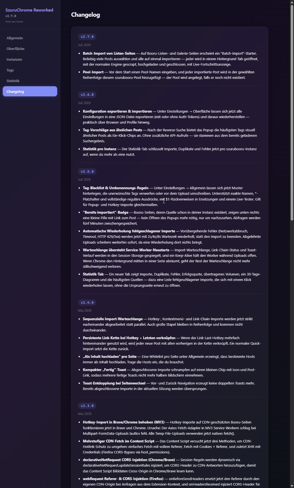

# SzuruChrome Reworked

> A fork of [neobooru/SzuruChrome](https://github.com/neobooru/SzuruChrome) with quality-of-life improvements, bug fixes, and a modernized UI.

Browser extension (Chrome / Firefox / Waterfox) for importing media from various booru sites into a self-hosted [szurubooru](https://github.com/rr-/szurubooru) instance.



---

## Features

### Importing
| Feature | Description |
|---|---|
| **Right-Click Quick Import** | Right-click any booru page → "Import to selected Szuru instance" — imports instantly without opening the popup. |
| **Hotkey Import** | Configure a custom keyboard shortcut to import the current page with one keypress. |
| **Import + Link Last Hotkey** | A second configurable hotkey imports the current page and links it with the previously uploaded post. Consecutive uses build a link-chain. |
| **Batch Import** | On booru listing/gallery pages a launcher lets you select many posts and import them all at once — each is opened in a background tab, scraped, uploaded and closed, with a live progress bar. |
| **Pool Import** | Enter a pool name before starting a batch and every imported post is added to that szurubooru pool, in selection order (creating the pool if it doesn't exist). |
| **Sequential Import Queue** | Hotkey, context-menu and link-chain imports process strictly one after another, with automatic retry of transient failures (network drops, timeouts, HTTP 429/5xx). The queue survives a Chrome MV3 service-worker restart mid-burst. |
| **Auto-Relations** | After upload a reverse-image search runs automatically; posts above the configurable similarity threshold (default **60%**) are linked as relations. Toggle in Settings → General. |
| **Exact-Duplicate Handling** | For 100% matches the higher-quality file is kept and tags/sources are merged instead of creating a duplicate. |

### Tags & metadata
| Feature | Description |
|---|---|
| **Tag Blacklist & Rename Rules** | Patterns that drop or rewrite scraped tags before upload — exact names, `*` globs, or full regex with `$1` back-references, plus a live tester. Applies to popup and hotkey imports alike. |
| **Tag Suggestions** | After the reverse search, the popup offers the most common tags from visually similar posts as one-click chips (no extra API calls). |
| **Auto-import all tags** | Automatically imports all tags including their categories on supported pages (Danbooru, Zerochan, etc.). |
| **Tag Category Colors** | Map szurubooru tag categories to display colors, with a native color picker and one-click import from the instance. |
| **Fallback Source Tag Import** | When a fallback source URL is used, tags from the original booru source are also imported — no tags lost. |

### Feedback & insight
| Feature | Description |
|---|---|
| **"Already Imported" Badge** | A small pill on booru pages whose source already exists in your instance, linking to the post — no need to open the popup to check. |
| **Statistics Tab** | Imports, duplicates, failures, success rate, transferred volume, a 30-day activity chart and per-host / per-instance breakdown — plus a list of failed imports you can retry with one click. |
| **Config Export / Import** | Export all settings to a JSON file (optionally without auth tokens) and restore them — handy across browsers and profiles. |
| **Glass Notify Toasts** | Import status notifications in a modern glassmorphism style with progress, download speed and a compact completion history. |
| **Multi-Language (EN/DE)** | Switch the extension UI between English and German in Settings → Interface. |

### Reliability fixes (vs. original)
| Fix | Description |
|---|---|
| **403 / CDN hotlink protection** | Content uploads include credentials and Referer, with a multi-strategy CDN fetch (page-context fetch, credentials + Referer, XHR) and per-request CORS injection. |
| **MV3 FormData upload** | Temp-file uploads use native `fetch()` instead of the Axios fetch adapter, which silently failed on multipart uploads in Chrome/Brave service workers. |
| **Octet-Stream / ArrayBuffer** | Binary data is base64-encoded during message passing to survive MV3 serialization; missing MIME types are detected from the file extension. |
| **Filename Preservation** | Uploaded files retain their original filename from the source URL. |

## Screenshots

**Popup on a booru page**


**Batch import — select posts on a listing page**



| Settings — General (tag rules) | Settings — Statistics |
|---|---|
|  |  |
| **Settings — Interface (backup)** | **Settings — Tags** |
|  |  |
| **Settings — Instances** | **Settings — Changelog** |
|  |  |

## Installation

### Firefox / Waterfox

1. Download the `.xpi` from the [Releases](../../releases) tab
2. Open `about:addons` → gear icon → "Install Add-on From File…" → select the `.xpi`
3. Alternatively: `about:debugging` → "This Firefox" → "Load Temporary Add-on" → select the `.xpi`

> **Note:** For unsigned XPIs, set `xpinstall.signatures.required = false` in `about:config`.

### Chrome / Brave / Edge

1. Download the extension ZIP from the [Releases](../../releases) tab
2. Extract the ZIP anywhere (you'll get a folder containing `manifest.json`)
3. Open `chrome://extensions/`
4. Enable **Developer mode** (toggle in the top-right)
5. Click **Load unpacked** and select the extracted folder

> Chrome has no signed store build yet, so it's loaded unpacked — Developer mode has to stay enabled. Want to build it yourself instead? See [Build](#build).

## Build

```sh
npm install          # Install dependencies
npm run build        # Firefox/Waterfox production build → ./extension/
npm run build:chrome # Chrome/Brave/Edge production build → ./extension/
npm run pack:xpi     # Build Firefox .xpi → ./extension.xpi
npm run dev          # Dev mode with HMR
```

After building, load the `extension/` folder in your browser:
- **Chrome:** `chrome://extensions/` → "Load unpacked" → select `./extension`
- **Firefox:** `about:debugging` → "Load Temporary Add-on" → select any file in `./extension`

## Tech Stack

- **Vue 3** + Composition API + `<script setup>`
- **Pinia** for state management
- **PrimeVue 3** + PrimeFlex for UI components
- **Vite 5** as build tool (two configs: main app + content script)
- **webextension-polyfill** for cross-browser compatibility
- **neo-scraper** for booru page scraping

## Credits

This project is a fork of [neobooru/SzuruChrome](https://github.com/neobooru/SzuruChrome) (v1.1.24).
All original credit goes to [neobooru](https://github.com/neobooru) and contributors.

## License

[MIT](./LICENSE)

---

# 🇩🇪 SzuruChrome Reworked — Deutsche Version

> Ein Fork von [neobooru/SzuruChrome](https://github.com/neobooru/SzuruChrome) mit Quality-of-Life-Verbesserungen, Bugfixes und einer modernisierten Oberfläche.

Browser-Extension (Chrome / Firefox / Waterfox) zum Importieren von Medien von verschiedenen Booru-Seiten in eine selbst-gehostete [szurubooru](https://github.com/rr-/szurubooru)-Instanz.

## Funktionen

### Import
| Feature | Beschreibung |
|---|---|
| **Rechtsklick Quick Import** | Rechtsklick auf jeder Booru-Seite → "Zur gewählten Szuru-Instanz importieren" — importiert sofort ohne das Popup zu öffnen. |
| **Hotkey Import** | Konfigurierbare Tastenkombination zum sofortigen Import der aktuellen Seite. |
| **Import + letzten Post verknüpfen** | Ein zweites Tastenkürzel importiert die aktuelle Seite und verknüpft sie mit dem zuvor hochgeladenen Post. Mehrfach-Nutzung bildet eine Verknüpfungskette. |
| **Batch-Import** | Auf Listen-/Galerie-Seiten erscheint ein Starter, mit dem du viele Posts auswählen und auf einmal importieren kannst — jeder wird in einem Hintergrund-Tab geöffnet, gescrapt, hochgeladen und geschlossen, mit Live-Fortschritt. |
| **Pool-Import** | Vor dem Batch einen Pool-Namen eingeben, und jeder importierte Post wird in Auswahlreihenfolge diesem szurubooru-Pool hinzugefügt (wird angelegt, falls nicht vorhanden). |
| **Sequentielle Warteschlange** | Hotkey-, Kontextmenü- und Ketten-Importe laufen strikt nacheinander, mit automatischer Wiederholung vorübergehender Fehler (Netzwerkabbruch, Timeout, HTTP 429/5xx). Die Queue übersteht einen MV3-Service-Worker-Neustart mitten in einer Serie. |
| **Auto-Relationen** | Nach dem Upload läuft automatisch eine Reverse-Image-Suche; Posts über dem konfigurierbaren Schwellwert (Standard **60%**) werden als Relationen verknüpft. Umschaltbar unter Einstellungen → Allgemein. |
| **Exakte-Duplikat-Behandlung** | Bei 100%-Treffern wird die höherwertige Datei behalten und Tags/Quellen werden zusammengeführt, statt ein Duplikat anzulegen. |

### Tags & Metadaten
| Feature | Beschreibung |
|---|---|
| **Tag-Blacklist & Umbenennungs-Regeln** | Muster, die gescrapte Tags vor dem Upload verwerfen oder umschreiben — exakte Namen, `*`-Globs oder vollständige Regex mit `$1`-Rückverweisen, plus Live-Tester. Gilt für Popup- und Hotkey-Import. |
| **Tag-Vorschläge** | Nach der Reverse-Suche bietet das Popup die häufigsten Tags ähnlicher Posts als Ein-Klick-Chips an (ohne zusätzliche API-Aufrufe). |
| **Alle Tags automatisch importieren** | Importiert automatisch alle Tags inklusive Kategorien auf unterstützten Seiten (Danbooru, Zerochan, etc.). |
| **Tag-Kategorie-Farben** | szurubooru-Tag-Kategorien auf Anzeigefarben mappen, mit nativem Farbwähler und Ein-Klick-Import aus der Instanz. |
| **Fallback-Quellen-Tags** | Wird eine Fallback-Quelle genutzt, werden auch die Tags der Originalquelle importiert — keine Tags gehen verloren. |

### Feedback & Übersicht
| Feature | Beschreibung |
|---|---|
| **"Bereits importiert"-Badge** | Eine kleine Pille auf Booru-Seiten, deren Quelle schon in deiner Instanz existiert, mit Link zum Post — kein Popup-Öffnen zum Nachsehen nötig. |
| **Statistik-Tab** | Importe, Duplikate, Fehler, Erfolgsquote, übertragenes Volumen, 30-Tage-Diagramm und Aufschlüsselung pro Host / Instanz — plus eine Liste fehlgeschlagener Importe, die sich mit einem Klick wiederholen lassen. |
| **Konfiguration Export / Import** | Alle Einstellungen als JSON exportieren (optional ohne Auth-Tokens) und wiederherstellen — praktisch über Browser und Profile hinweg. |
| **Glass-Benachrichtigungs-Toasts** | Import-Status im modernen Glasmorphismus mit Fortschritt, Download-Geschwindigkeit und kompaktem Verlauf. |
| **Mehrsprachig (EN/DE)** | Extension-Oberfläche unter Einstellungen → Oberfläche zwischen Englisch und Deutsch umschalten. |

### Zuverlässigkeits-Fixes (vs. Original)
| Fix | Beschreibung |
|---|---|
| **403 / CDN-Hotlink-Schutz** | Content-Uploads enthalten Credentials und Referer, mit Multi-Strategie-CDN-Fetch (Page-Context-Fetch, Credentials + Referer, XHR) und CORS-Injektion pro Request. |
| **MV3 FormData-Upload** | Temp-Datei-Uploads nutzen natives `fetch()` statt des Axios-Fetch-Adapters, der bei Multipart-Uploads in Chrome/Brave-Service-Workern still fehlschlug. |
| **Octet-Stream / ArrayBuffer** | Binärdaten werden bei der Nachrichtenübermittlung base64-kodiert, um MV3-Serialisierung zu überleben; fehlende MIME-Typen werden aus der Dateiendung erkannt. |
| **Dateinamen-Erhaltung** | Hochgeladene Dateien behalten ihren originalen Dateinamen aus der Quell-URL. |

## Screenshots

**Popup auf einer Booru-Seite**


**Batch-Import — Posts auf einer Listen-Seite auswählen**


| Einstellungen — Allgemein (Tag-Regeln) | Einstellungen — Statistik |
|---|---|
|  |  |
| **Einstellungen — Oberfläche (Backup)** | **Einstellungen — Tags** |
|  |  |
| **Einstellungen — Instanzen** | **Einstellungen — Changelog** |
|  |  |

## Installation

### Firefox / Waterfox

1. `.xpi` aus dem [Releases](../../releases)-Tab herunterladen
2. `about:addons` → Zahnrad-Icon → "Add-on aus Datei installieren…" → `.xpi` auswählen
3. Alternativ: `about:debugging` → "Dieser Firefox" → "Temporäres Add-on laden" → `.xpi` auswählen

> **Hinweis:** Für unsignierte XPIs: `xpinstall.signatures.required = false` in `about:config` setzen.

### Chrome / Brave / Edge

1. Das Extension-ZIP aus dem [Releases](../../releases)-Tab herunterladen
2. Das ZIP irgendwohin entpacken (du erhältst einen Ordner mit `manifest.json`)
3. `chrome://extensions/` öffnen
4. **Entwicklermodus** aktivieren (Schalter oben rechts)
5. **Entpackte Erweiterung laden** klicken und den entpackten Ordner auswählen

> Für Chrome gibt es noch keinen signierten Store-Build, daher wird er entpackt geladen — der Entwicklermodus muss aktiviert bleiben. Lieber selbst bauen? Siehe [Build](#build).

## Build

```sh
npm install          # Dependencies installieren
npm run build        # Firefox/Waterfox Production-Build → ./extension/
npm run build:chrome # Chrome/Brave/Edge Production-Build → ./extension/
npm run pack:xpi     # Firefox .xpi bauen → ./extension.xpi
npm run dev          # Dev-Modus mit HMR
```

Nach dem Build den `extension/`-Ordner im Browser laden:
- **Chrome:** `chrome://extensions/` → "Entpackte Erweiterung laden" → `./extension` auswählen
- **Firefox:** `about:debugging` → "Temporäres Add-on laden" → beliebige Datei in `./extension` auswählen

## Tech Stack

- **Vue 3** + Composition API + `<script setup>`
- **Pinia** für State-Management
- **PrimeVue 3** + PrimeFlex für UI-Komponenten
- **Vite 5** als Build-Tool (zwei Configs: Haupt-App + Content-Script)
- **webextension-polyfill** für Cross-Browser-Kompatibilität
- **neo-scraper** zum Scrapen von Booru-Seiten

## Credits

Dieses Projekt ist ein Fork von [neobooru/SzuruChrome](https://github.com/neobooru/SzuruChrome) (v1.1.24).
Alle Credits gehen an [neobooru](https://github.com/neobooru) und die Mitwirkenden.

## Lizenz

[MIT](./LICENSE)
